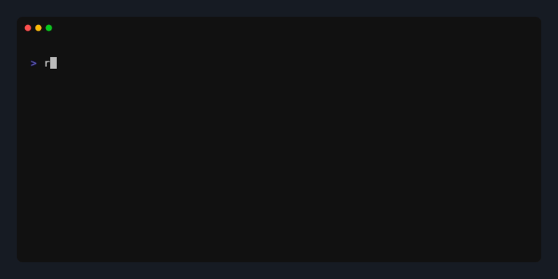

# ReReadme


[](https://www.npmjs.com/package/@cjlludwig/rereadme)

`rereadme` is a CLI tool that refreshes `README.md` files by analyzing a repository and generating an updated README from a template using an AI agent workflow built on the OpenAI Agents SDK. It supports both a full regeneration mode and a PR-friendly CI mode that analyzes diffs and produces targeted patch suggestions.

<!-- markdownlint-disable -->
<div align="center">
   
</div>
<!-- markdownlint-enable -->

## Why rereadme?

In most engineering organizations, distributed systems READMEs are stale at best and nonexistent at worst. They're treated as optional hygiene rather than critical infrastructure. Historically, the cost of poor documentation was absorbed through onboarding friction and tribal knowledge — inefficient, but tolerable.

That economic model does not scale in an AI-assisted development environment.

Headless coding agents now interact with your repository repeatedly. Each session must reconstruct context that should already exist in a well-written README. Without it, agents navigate blindly attempting to gather context. A realistic orientation pass for a non-trivial service often consumes
**>10,000 tokens per session**. If documentation is stale or missing, that cost repeats every time an agent session begins.

> Pay once to persist context. Or pay repeatedly to rediscover it.

`rereadme` runs a tuned agent workflow that explores your repository deliberately, synthesizes context, and persists it as a high-signal README. Because the workflow is CI-friendly, pull requests can be evaluated against the existing documentation to detect drift — changes that modify behavior without updating docs can be flagged or failed automatically.

## Quick Start

```shell
npm install -g @cjlludwig/rereadme

export OPENAI_API_KEY="your_api_key_here"

# Run in any repo
cd /your/repo
rereadme
```

## Getting Started

> [!IMPORTANT]
> `rereadme` sends Git-tracked file contents to the OpenAI API to generate documentation. Gitignored files are never read and all agent access is sandboxed to the repo root but if your organization has data-governance or IP policies around external AI services, review those before use.
>
> See [Security](docs/security.md) for access protections and [Observability](docs/observability.md) for agent trace visibility.

### Dependencies

- Node.js >= 22.0.0 (enforced by `engines.node` in `package.json`)
- `OPENAI_API_KEY` environment variable (see OpenAI [Developer Quickstart](http://developers.openai.com/api/docs/quickstart/))
  - Optional: `OPENAI_BASE_URL` environment variable for enterprise API keys scoped to regional endpoints (e.g., `https://us.api.openai.com/v1`)
- Optional: `markdownlint-cli` for formatting and linting of the generated README

**Troubleshooting Dependencies:**

- Run `rereadme --check` to verify all tools are installed correctly (or `npm run check` if using locally)
- For markdownlint issues, try the npm version: `npm install -g markdownlint-cli`

### Installation

#### Global Installation (Recommended)

```shell
npm install -g @cjlludwig/rereadme

# Verify installation
rereadme --help
```

## Usage

> For real-world usage scenarios, see [Workflows](docs/workflows.md).

### CLI Tool Usage

```shell
# Run the complete README refresh workflow in current directory
rereadme

# Show detailed command output
rereadme --verbose

# Run with interactive mode (pause between steps)
rereadme --interactive

# Specify output file
rereadme --output README-new.md

# Override the AI model (default: gpt-5-nano, tuned for cost-efficiency)
# Frontier models (e.g. gpt-4o, 5.2) produce richer output at higher cost
rereadme --model gpt-5.2

# Skip backup creation
rereadme --no-backup

# Generate agents documentation
rereadme --agents
rereadme --agents --agents-output AGENTS.md

# Use custom templates
rereadme --template MY_TEMPLATE.md
rereadme --agents --agents-template MY_AGENTS_TEMPLATE.md

# CI mode: analyze diff and write README-suggestions.md
rereadme --ci
rereadme --ci --base-ref origin/main

# CI mode: analyze diff and apply patches directly to README.md
rereadme --ci --apply

# Apply an existing suggestions file to README.md
rereadme --apply
rereadme --apply --ci-output custom-suggestions.md

# Check dependencies only
rereadme --check

# Show help
rereadme --help
```

### Local Development Usage

```shell
npm run dev                        # Run basic workflow
npm run dev -- --verbose          # Show detailed output
npm run dev -- --interactive      # Run with manual step approval
npm run dev -- --check            # Check dependencies only
npm run help                       # Show help
```

### CI Integration

Add `rereadme` to your PR pipeline to detect documentation drift automatically. The `DiffAnalyzer` agent reads the diff, determines whether changes are significant enough to document, and posts suggestions as a PR comment without modifying the README.

```yaml
# .github/workflows/readme-ci.yml
name: README CI Suggestions
on:
  pull_request:
    branches: [main]
jobs:
  readme-suggestions:
    runs-on: ubuntu-latest
    permissions:
      pull-requests: write
    steps:
      - uses: actions/checkout@v4
        with:
          fetch-depth: 0
      - uses: cjlludwig/ReReadme@v0
        with:
          openai-api-key: ${{ secrets.OPENAI_API_KEY }}
# ⚠️ README-suggestions.md written on drift
# ✍️ PR comment posted automatically
```

Adding `--apply` writes the patched README directly to `README.md` (with a timestamped backup):

```shell
# Analyze diff and write suggestions only (safe, no README changes)
rereadme --ci

# Analyze diff and apply patches in one step
rereadme --ci --apply

# Apply a previously written suggestions file
rereadme --apply
```

### Custom Templates

> For template design guidance and conventions, see [Templates](docs/templates.md).

Supply your own markdown template with `--template FILE` (for README) or `--agents-template FILE` (for AGENTS.md, requires `--agents`).

Template requirements:

- Must be a valid markdown file with at least one heading (`#`)
- Use `>` blockquote lines as content descriptors (matches agent behavior)
- Use `<--` comment blocks to contain content examples (matches agent behavior)
- Maximum size: 50KB

## Architecture

> For local setup, development workflow, and contribution standards, see [Development](docs/development.md).
> See [Observability](docs/observability.md) for more details on the agentic workflow.

The tool is built using:

- **OpenAI Agents SDK** — AI-driven README generation and diff analysis with full tracing support
- **Google ZX** — Shell operations and CLI orchestration
- **TypeScript** — Type-safe development with modern JavaScript features

## Quality

LLMs are inherently non-deterministic, so `rereadme` takes a two-layer approach to quality. Tool calls are tested explicitly in the Jest unit suite to assert allowed filesystem actions and path boundaries — the deterministic, security-critical behavior that must hold on every run.

General output quality — structure, accuracy, completeness — is validated through a DeepEval eval framework that runs `rereadme` against real dataset repos and compares output against golden READMEs using both deterministic checks and an LLM-as-judge metric.

See [evals/README.md](evals/README.md) for setup, metrics, and the golden README workflow.

## Security

`rereadme` is designed for use in shared environments and CI pipelines. Key protections:

- **Repo-sandboxed filesystem access** — Every agent path request is resolved against the working directory and rejected if it escapes (`safePath()` in `lib/tools.ts`). No file outside the repo root can be read.
- **Gitignored files are never exposed** — All filesystem tools enforce gitignore rules before returning content. Secrets, credentials, and sensitive files in `.gitignore` are never sent to the AI.
- **Git-repo requirement** — The tool does not run outside a git repository, ensuring gitignore protections are always active.
- **Read-only agents** — Agent tools are read-only. File writes happen only at the CLI layer with a timestamped backup. In CI mode, the README is never modified unless `--apply` is explicitly passed.
- **No telemetry** — The only external network calls are to the OpenAI API. No usage data is routed anywhere else.
- **API key never written to disk** — `OPENAI_API_KEY` is read from the environment and never included in output files, agent traces, or verbose logs.

See [Security](docs/security.md) for full details.

## Contributing

Contributions are welcome. See [Development](docs/development.md) for setup, workflow, and quality standards.

Open issues and feature requests at [github.com/cjlludwig/rereadme/issues](https://github.com/cjlludwig/rereadme/issues).

## Troubleshooting

**Common issues:**

- **Missing dependencies** — Run `rereadme --check` to identify missing tools
- **OpenAI API errors** — Ensure `OPENAI_API_KEY` is set and has sufficient credits
- **Permission errors** — Ensure you have write access to `README.md`

**Tips:**

- Use `--interactive` mode to review changes at each step
- Use `--verbose` to see detailed command output and live agent tool calls for debugging
- The tool creates automatic timestamped backups before overwriting any file
- The tool works best with structured codebases that follow standard conventions

## References

- [Google ZX Documentation](https://google.github.io/zx/)
- [OpenAI Agents SDK Documentation](https://openai.github.io/openai-agents-js/)
- [OpenAI Platform — Traces](https://platform.openai.com/logs?api=traces)
- [Markdownlint CLI](https://github.com/igorshubovych/markdownlint-cli)

## License

This project is licensed under the MIT License.
