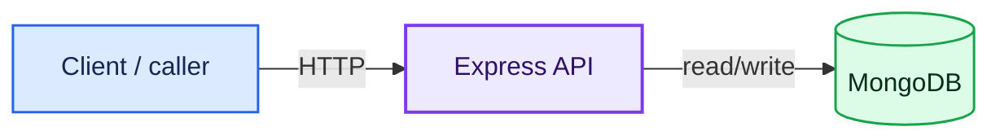

# express-server


## Description

Minimal Express.js server with a Document API backed by MongoDB. Designed for local development and experimentation with a lightweight data layer.

## Getting Started

### Dependencies

- Node.js
- MongoDB running on `localhost:27017`
- Docker + VS Code Dev Containers extension (optional)

### Installation

1. Install dependencies
```shell
npm i
```

2. Ensure MongoDB is running locally
```shell
# You may start MongoDB with your usual method, for example:
mongod --config /path/to/your/mongod.conf
```

3. Start the server
```shell
npm start
```

Server runs on `http://localhost:9000`

### Alternative Development Environment

If you use the provided Dev Container configuration:

- Open the repository in a VS Code Dev Container to automatically start a Node.js + MongoDB environment.
- The dev container includes a docker-compose file that brings up the app and a MongoDB instance.

## Usage

```shell
npm run start # Start server on http://localhost:9000

# Health check
curl http://localhost:9000/

# Create document
curl -X POST -H "Content-Type: application/json" \
  -d '{"_id":"doc1","title":"Sample"}' \
  http://localhost:9000/api/document

# Get document by ID
curl http://localhost:9000/api/document/doc1
```

## Architecture



## References

- [Express](https://expressjs.com/)
- [MongoDB Node.js Driver](https://www.npmjs.com/package/mongodb)
- [http-status-codes](https://www.npmjs.com/package/http-status-codes)
- [VS Code Dev Container](https://code.visualstudio.com/docs/devcontainers/containers)

## Help

- MongoDB must be running and accessible at `mongodb://localhost:27017`. If the database connection fails, the server will log an error and may be unable to handle requests that interact with documents.
- The POST handler in the repository currently attempts to parse the request body in a way that may conflict with the Express JSON body parser. If you encounter issues, consider using a correctly parsed body object, e.g., `const body = req.body;` and ensure the middleware `app.use(express.json())` is in place.
- The server listens on port 9000 by default; if you need to change the port, modify `src/server.js`.

## License

This project is licensed under the [MIT License](LICENSE).
