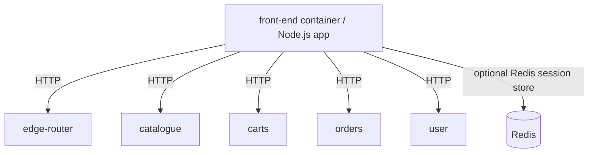

# AGENTS.md

## Project

`microservices-demo-front-end` is a deprecated front-end application that aggregates the `microservices-demo` services, built with `JavaScript`, `Node.js`, `Express`, and optional `Redis`-backed sessions.

## Commands

```shell
# Install
npm install                          # install Node.js dependencies
make test-image                      # build the Docker image used for local runs and tests

# Develop / Run
npm start                            # start the app with Node.js (defaults to `localhost:8079`; README uses `localhost:8081`)
make up                              # start backing microservices with Docker Compose, build image, install deps in container, and run front-end on `localhost:8080`
make server                          # run the front-end container on `localhost:8080`
make dev                             # rebuild and run the local front-end container for e2e debugging, then tail logs
make down                            # stop the front-end container and Docker Compose services

# Validate
npm test                             # run unit and API tests with `mocha` via `istanbul`
make test                            # run unit tests in Docker
make coverage                        # generate coverage and JUnit-style test results in Docker
make e2e                             # run `casperjs` end-to-end tests against the Docker Compose stack

# Image publish
GROUP=weaveworksdemos COMMIT=test ./scripts/push.sh  # push image with required env vars
```

## Architecture



## Constraints

- **Generated files**: do not edit `dist/`, `build/`, or lock files directly
- **Project status**: this repository is marked deprecated in `README.md`
- **E2E prerequisites**: end-to-end tests assume the microservices stack is already up and the front-end is reachable at `http://front-end:8080/`
- **Docker network**: `make server` and `make e2e` expect the `test_default` network created by `docker-compose -f test/docker-compose.yml up -d`

## Environment

- **Required**: `Docker` `>= 1.12`; `Docker Compose` `>= 1.8.0`; `Make` `>= 4.1` is optional
- **Setup**: run `npm install` for local Node.js usage, or use `make up` to provision the Docker Compose-backed environment
- **Services**: tests and Docker-based runs depend on the backing demo services defined in `test/docker-compose.yml`
- **Variables**: `PORT` overrides the app listen port; `SESSION_REDIS` enables Redis session storage; `GROUP` and `COMMIT` are required by `./scripts/push.sh`

## Quality

- **Tests**: unit tests live in `test/*_test.js` and API tests in `test/api/*_test.js`; e2e tests live in `test/e2e/*_test.js` and are run by `test/e2e/runner.sh` with `casperjs`
- **CI**: GitHub Actions installs dependencies, runs `make test`, builds the Docker image, runs `./test/container.sh`, and only pushes images on `master` or version tags using `DOCKER_USER` and `DOCKER_PASS` secrets
