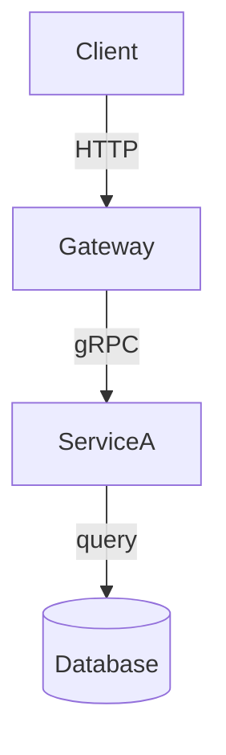

# {Project Title}

<!-- BADGES (Optional)
Infer and render relevant badges immediately after the project title, before ## Description.
Only include badges for tooling, services, or configuration actually present in the codebase.

Common sources to check:
- package.json / pyproject.toml / go.mod → language and runtime version badges
- CI config (.github/workflows, .circleci, .travis.yml) → build status badge using the actual workflow file path
- License file or license field in package.json → license badge
- Docker / devcontainer config → docker badge
- Test framework present (jest, pytest, mocha, etc.) → link to test config or coverage if wired up

Format: shields.io static badges or official badge URLs where they exist.
Use the repo's own metadata for labels and colors — do not invent version numbers or status.
-->

<!-- EXAMPLE


-->

## Description

> A few concise sentences or paragraphs: what does this project do and why does it exist?

## Getting Started

### Dependencies

> Bulleted list of prerequisites NOT installed by the package manager:
> - Runtime and version (e.g. `Node.js >= 18`, `Python 3.11 via pyenv`)
> - External services with default connection string (e.g. MongoDB on `localhost:27017`)
> - Optional tooling on its own line, marked `(optional)` (e.g. Docker + VS Code Dev Containers extension)

### Environment Variables

> (Optional) If environment variables are required to run. Include optional vars that are common as well.

<!-- EXAMPLE
```shell
export API_KEY=foo # Used for ...
```
-->

### Installation

> Numbered steps. Each step with a shell command must use a fenced code block indented.

<!-- EXAMPLE
1. Clone the repository
```shell
   git clone https://github.com/org/repo.git && cd repo
```

2. Install dependencies
```shell
   npm install
```

3. Configure environment
```shell
   cp .env.example .env
```

4. Start the service — see [Usage](#usage)
-->

## Usage

> Show how to interact with the project after it is running. Include only modes present in the codebase. If multiple modes exist, use one fenced block per mode with a bold label above each block.
>
> **CLI / script** — A realistic invocation with real flags and inline comments. Include `--help` output or link to it.
> **API** — SDK first if one exists. Then link OpenAPI/Swagger spec as primary REST reference. Show auth stub, one representative versioned call, and one error response shape. If no spec exists, link the primary route definition file and note the absence. Use `$BASE_URL` throughout — never hardcode URLs.
> **Library** — Minimal import + initialization + one non-obvious representative call in the project's language. Avoid trivial CRUD examples.
>
> Show the minimal path from installation to a successful, verifiable output.

<!-- EXAMPLE STRUCTURE — do not reproduce literally -->
**Start**
```shell
# replace with actual start command and describe what it starts and where it listens
npm run start
```

**API**

API reference: [Swagger UI](http://localhost:PORT/docs) · [`openapi.yaml`](./openapi.yaml)
<!-- If no spec found: link primary route definitions e.g. [`src/routes/widgets.ts`](./src/routes/widgets.ts) -->
```shell
# Local development
export BASE_URL=http://localhost:3000

# Deployed (environment-specific — do not hardcode)
# export BASE_URL=https://api.internal.company.com

# Authenticate
curl -X POST $BASE_URL/v1/auth/token \
  -H "Content-Type: application/json" \
  -d '{"client_id": "x", "client_secret": "y"}'

# Create a widget (representative write)
curl -X POST $BASE_URL/v1/widgets \
  -H "Authorization: Bearer <token>" \
  -H "Content-Type: application/json" \
  -d '{"name": "example", "type": "foo"}'

# Error response shape
# HTTP 422
# {"error": "validation_failed", "fields": {"name": "required"}}
```

**Library**
```js
import foo from "<package-name>";

const client = foo({ option: "value" });
client.method(args); // describe what this does
```
<!-- END EXAMPLE STRUCTURE -->

## Architecture

> Only include this section if the project has non-obvious topology — multiple services, external dependencies, or a request flow not inferrable from the file structure. Omit for simple or single-concern repos.
>
> When included, use Mermaid `graph TD` if multiple services or external dependencies exist with explicit config or instantiation. Otherwise omit the section entirely.
>
> Only diagram components with direct instantiation or a config entry. Do not infer from imports alone.

<!-- EXAMPLE STRUCTURE — do not reproduce literally -->

<!-- END EXAMPLE STRUCTURE -->

## References

> (Optional) Markdown link list to official docs for each named technology in the README.
> Format: `- [Technology Name](url)`

## Help

> (Optional) Known issues, required environment quirks, and common errors.
> Format each entry as: `- **Short label**: Explanation and fix.`
> Cover at minimum: any external service connection requirements, any non-obvious env setup.

## License

> (Optional) Include if a LICENSE file or license identifier was found in the codebase.
> Format: one line naming the license, followed by a link to the LICENSE file if present.

<!-- EXAMPLE
This project is licensed under the [MIT License](LICENSE).
-->
